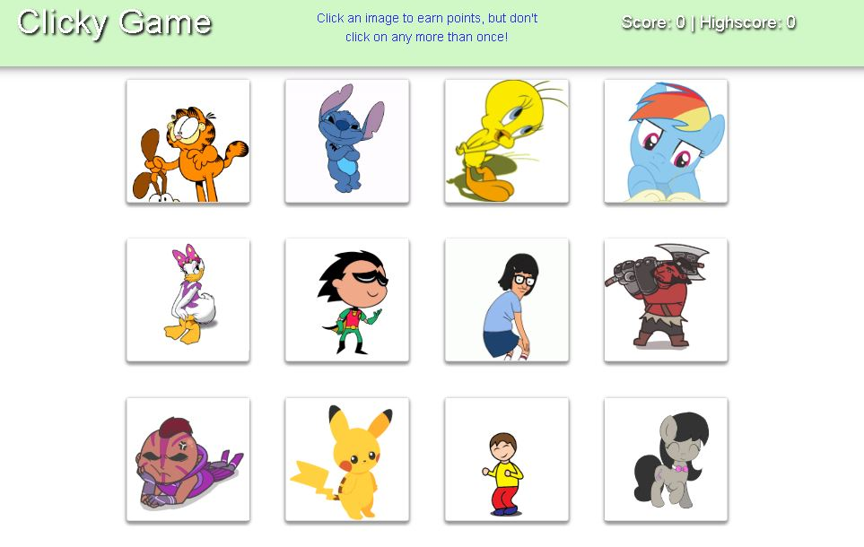

# React Clicky Game

Clicky Game is built with React components and is deployed on GitHub Pages. 

## Instructions

1. Click all twelve cards only once.
2. If a card is clicked twice, the cards will shake, and the round is over, and the score is reset. 

## Build With

* [React](https://reactjs.org/) - Creates UI components
* [Bootstrap](https://getbootstrap.com/) - Makes it pretty
* [GitHub Pages](https://pages.github.com/) - Deployment
* [NPM](https://www.npmjs.com/) - Small packages of reuseable code that pack a big punch (yarn)

## [Live Demo](https://nahrinoda.github.io/gify-reactgame/)